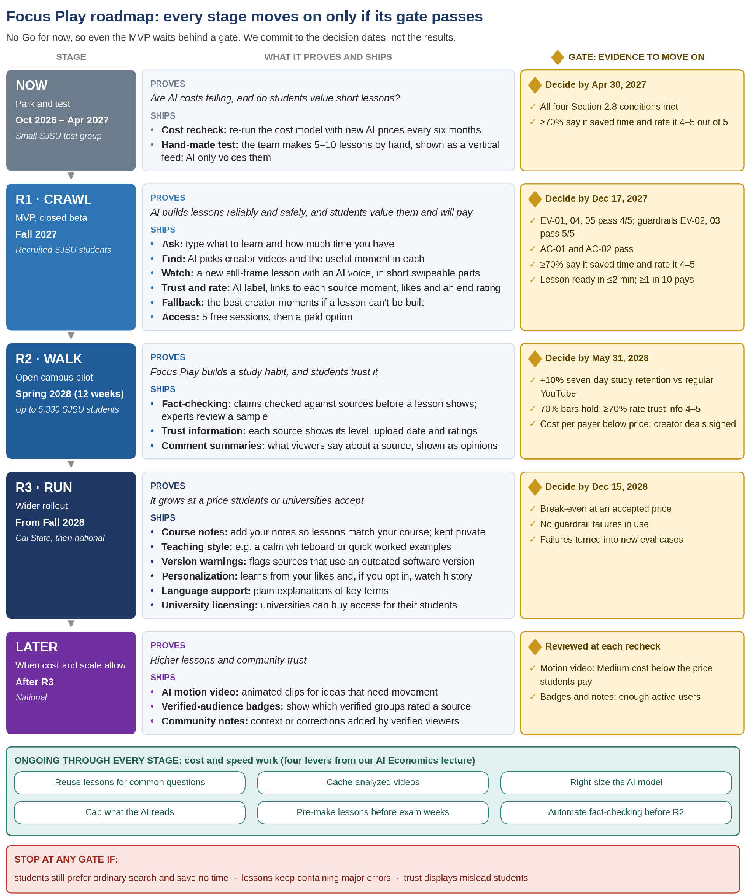

# 10. Product Roadmap

Because we recommend No-Go for now, the roadmap starts with a checkpoint, not a build: even the MVP ships only if its gate passes. We use Geoffrey Moore's vision, strategy and time-based roadmap format [19], giving each stage its goal, its features and the evidence that shows the goal is met, and we add a gate and a decide-by date to every stage. For AI features we commit to the decision date and the decision, not the result.

<!-- IMAGE TRANSCRIPTION: the original document embeds this graphic; all text in it is transcribed below so no information is lost. File: assets/image1_roadmap.png -->

**Image content (transcribed). Title: "Focus Play roadmap: every stage moves on only if its gate passes".**
Subtitle: "No-Go for now, so even the MVP waits behind a gate. We commit to the decision dates, not the results."
The graphic has three columns per stage: STAGE | WHAT IT PROVES AND SHIPS | GATE: EVIDENCE TO MOVE ON. Stages are connected by down arrows, in this order: NOW, R1 CRAWL, R2 WALK, R3 RUN, LATER.

| Stage | What it proves and ships | Gate: evidence to move on |
|---|---|---|
| **NOW** Park and test **Oct 2026 – Apr 2027** *Small SJSU test group* | **Proves:** *Are AI costs falling, and do students value short lessons?* **Ships:** • **Cost recheck:** re-run the cost model with new AI prices every six months • **Hand-made test:** the team makes 5–10 lessons by hand, shown as a vertical feed; AI only voices them | **Decide by Apr 30, 2027** ✓ All four Section 2.8 conditions met ✓ ≥70% say it saved time and rate it 4–5 out of 5 |
| **R1 · CRAWL** MVP, closed beta **Fall 2027** *Recruited SJSU students* | **Proves:** *AI builds lessons reliably and safely, and students value them and will pay* **Ships:** • **Ask:** type what to learn and how much time you have • **Find:** AI picks creator videos and the useful moment in each • **Watch:** a new still-frame lesson with an AI voice, in short swipeable parts • **Trust and rate:** AI label, links to each source moment, likes and an end rating • **Fallback:** the best creator moments if a lesson can't be built • **Access:** 5 free sessions, then a paid option | **Decide by Dec 17, 2027** ✓ EV-01, 04, 05 pass 4/5; guardrails EV-02, 03 pass 5/5 ✓ AC-01 and AC-02 pass ✓ ≥70% say it saved time and rate it 4–5 ✓ Lesson ready in ≤2 min; ≥1 in 10 pays |
| **R2 · WALK** Open campus pilot **Spring 2028 (12 weeks)** *Up to 5,330 SJSU students* | **Proves:** *Focus Play builds a study habit, and students trust it* **Ships:** • **Fact-checking:** claims checked against sources before a lesson shows; experts review a sample • **Trust information:** each source shows its level, upload date and ratings • **Comment summaries:** what viewers say about a source, shown as opinions | **Decide by May 31, 2028** ✓ +10% seven-day study retention vs regular YouTube ✓ 70% bars hold; ≥70% rate trust info 4–5 ✓ Cost per payer below price; creator deals signed |
| **R3 · RUN** Wider rollout **From Fall 2028** *Cal State, then national* | **Proves:** *It grows at a price students or universities accept* **Ships:** • **Course notes:** add your notes so lessons match your course; kept private • **Teaching style:** e.g. a calm whiteboard or quick worked examples • **Version warnings:** flags sources that use an outdated software version • **Personalization:** learns from your likes and, if you opt in, watch history • **Language support:** plain explanations of key terms • **University licensing:** universities can buy access for their students | **Decide by Dec 15, 2028** ✓ Break-even at an accepted price ✓ No guardrail failures in use ✓ Failures turned into new eval cases |
| **LATER** When cost and scale allow **After R3** *National* | **Proves:** *Richer lessons and community trust* **Ships:** • **AI motion video:** animated clips for ideas that need movement • **Verified-audience badges:** show which verified groups rated a source • **Community notes:** context or corrections added by verified viewers | **Reviewed at each recheck** ✓ Motion video: Medium cost below the price students pay ✓ Badges and notes: enough active users |

**Green box in the graphic: "ONGOING THROUGH EVERY STAGE: cost and speed work (four levers from our AI Economics lecture)".** Six items shown: Reuse lessons for common questions; Cache analyzed videos; Right-size the AI model; Cap what the AI reads; Pre-make lessons before exam weeks; Automate fact-checking before R2.

**Red box in the graphic: "STOP AT ANY GATE IF:"** students still prefer ordinary search and save no time · lessons keep containing major errors · trust displays mislead students
<!-- END IMAGE TRANSCRIPTION -->

## How to read the roadmap

- **Read it top to bottom.** Each row is a stage: when and where it runs, what it proves and what ships.
- **The amber box is the gate:** the evidence we need before the next stage starts, and the date we decide. If a gate fails, the next stage does not start; we stay where we are and recheck at the next six-monthly review.
- **The red strip lists the kill criteria** from our AI Prototype Canvas [2]: if any of them is true at a gate, we stop the work, not just pause it.
- **The green band runs through every stage:** cost and speed work that does not depend on evidence to start, so it is reviewed at each recheck rather than gated.

**Beta and rollout timing.** We time the beta in three steps: a closed beta with recruited students (R1), an open campus pilot (R2), then a wider rollout (R3). We roll out by campus, with San José State as our beachhead, then the Cal State system, then nationally, and by subject, starting with a few subjects where creators have given permission.

## Roadmap detail

<!-- TABLE 13: 6 data rows x 5 columns; first row is the header row; row 7: the cell in column 2 spans columns 2-5 (merged); its text is shown in column 2 and the spanned columns are left empty -->
<!-- Visually highlighted (shaded) cells in the original, marking key/emphasis rows or cells: data row 1 (columns 4,5); data row 2 (columns 4,5); data row 3 (columns 4,5); data row 4 (columns 4,5); data row 5 (columns 4,5) -->
| **Stage, timing and where** | **Goal: what are we proving?** | **High-level features** | **Gate: evidence needed to proceed** | **Decide by** |
|---|---|---|---|---|
| **NOW: Park and test** Oct 2026 – Apr 2027 *A small group of SJSU students* Type: None | Whether students value short lessons, and whether AI costs are falling, before building anything | **Cost recheck:** we re-run the cost model every six months with the latest AI prices, to see whether the Section 2.8 conditions are met **Hand-made test:** the team makes 5–10 lessons by hand and shows them to a small group of SJSU students as a vertical feed, with AI used only for the voice. This tests whether students value short lessons before anything is built | All four conditions in Section 2.8; in the hand-made test, at least 70% say it saved them time and rate it 4 or 5 out of 5 | **Apr 30, 2027, then every six months** |
| **R1: Crawl** (MVP, closed beta) Fall 2027 *Recruited SJSU students; a few subjects* Type: Mixed | AI can build short lessons reliably and safely, and students value and will pay for them | **Ask:** the student types what she wants to learn and how much time she has **Find:** AI picks relevant creator videos and the most useful moment in each **Watch:** AI turns those moments into a new lesson (still-frame visuals with an AI voice, no creator footage, no repeated content) that fits her time, shown as short parts she swipes through; each part replays until she swipes **Stay in scope:** requests outside study lessons are refused **Trust and rate:** every part carries an AI-generated label and a link to the exact source moment; she can like or dislike each part, and rates helpfulness and time saved at the end **Fallback:** if a lesson cannot be built, she sees the best creator moments instead **Access:** 5 free sessions, then a paid option, in a few subjects from a handful of creators who have given permission | EV-01, EV-04 and EV-05 pass 4 of 5; guardrails EV-02 and EV-03 pass 5 of 5; AC-01 and AC-02 pass; at least 70% say it saved them time and rate it 4 or 5 out of 5; a lesson is ready within two minutes; at least 1 in 10 trial students pays | **Dec 17, 2027** |
| **R2: Walk** (campus pilot) Spring 2028, 12 weeks *Open to up to 5,330 SJSU students* Type: Mixed | Focus Play builds a study habit at campus scale, and students trust it | **Fact-checking:** each claim is checked against its source before the lesson is shown, and subject experts review a sample **Trust information:** each source card shows the video's level, upload date and audience ratings, so students can judge it at a glance **Comment summaries:** a short AI summary of what viewers say about a source, presented as opinions, not proof | 10% relative lift in seven-day study retention against a matched group on regular YouTube; the 70% bars hold at pilot scale; at least 70% rate the trust information 4 or 5 out of 5; cost per paying student below the price; creator agreements signed | **May 31, 2028** |
| **R3: Run** From Fall 2028 *Cal State, then national* Type: Mixed | It grows across campuses at a price students or universities accept | **Course notes:** students add lecture notes or a syllabus so lessons match their course; notes stay private **Teaching style:** students choose how lessons are taught, for example a calm whiteboard or quick worked examples **Version warnings:** sources that use an outdated version of a software tool are flagged **Personalization:** lessons improve from each student's likes and dislikes and, if she opts in, her watch history **Language support:** plain explanations of key terms for students learning in a second language **University licensing:** universities can buy access for all their students | Break-even at a price students or universities accept; no guardrail failures in use; failures logged and turned into new eval cases | **Dec 15, 2028** |
| **Later** After R3 *National* Type: Mixed | Richer lessons and community trust, once cost and scale allow | **AI motion video:** short animated clips for ideas that need movement, added once the Medium version costs less than students pay **Verified-audience badges:** show whether verified students, instructors or professionals rated a source **Community notes:** context or corrections added by verified viewers | Motion video: the cost model shows the Medium version below the price students pay. Badges and notes: enough active users to make them useful | **Each six-monthly recheck after R3** |
| **Ongoing: cost and speed** | Runs through every stage, using the four levers from our AI Economics lecture [19]. These do not depend on evidence to start, so they are reviewed at each six-monthly recheck rather than gated. **Reuse lessons:** lessons for common questions, such as popular exam topics, are made once and served many times **Cache analyzed videos:** a creator video is read once and reused across lessons **Right-size the AI model:** a cheaper model finds videos; a stronger one only writes lessons **Cap what the AI reads:** short transcript excerpts instead of whole videos **Prepare before exam weeks:** lessons for common topics are ready in advance, which helps meet the two-minute target **Automate fact-checking:** fewer lessons need expert review, before R2 (Section 2.8, condition 3) |  |  |  |

**Every feature has a place.** The 15 MVP Must-haves ship in R1. Fact-checking, trust information and AI comment summaries follow in R2; course notes, teaching style, outdated-version warnings, personalization and language support in R3; motion video, verified-audience badges and community notes later. Progress tracking, quizzes, leaderboards and ads stay out (Appendix 7C).

**Constraints and business challenges.**

- **Cost and speed of AI video:** what drives the No-Go (Section 2).
- **Willingness to pay:** whether students will pay at all.
- **Creators:** permission and payment.
- **Expert reviewers:** capacity once fact-checking returns in R2.
- **Privacy:** student privacy rules.
- **Budget and engineering time:** about $0.6 million to build a prototype and pilot; 3–5 engineer-months for the prototype and 12–20 for the pilot [2].

**Kill criteria at every gate, from our AI Prototype Canvas [2]:** stop if students still prefer ordinary search and save no time; stop generating lessons if they keep containing major errors; drop trust displays if they mislead students.
