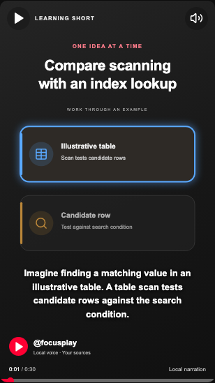
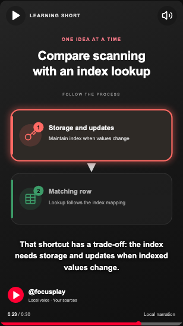

# Visual storyboards and audio synchronisation — handback #1

## Delivered scope

New generation uses `ModelStoryboard` / `StoryboardDraft`, not the legacy flat `ModelShort`. Each short has one objective, 2–5 ordered cited beats (3–5 recommended), and 1–3 diagram scenes. A beat has a stable ID, learning purpose, scene binding, and 1–8 explicit operations. A simpler two-beat explanation remains allowed. Existing word bounds and the measured 40-second short limit remain in force. This does **not** implement whole-session duration planning (#5).

Supported authoring operations and compiled equivalents:

| Authoring | Playback | Required target |
| --- | --- | --- |
| `reveal` | `appear` | Existing node, not already visible |
| `hide` | `disappear` | Visible node |
| `focus` | `highlight` | Visible node |
| `connect` | `draw` | Undrawn connection with visible endpoints |
| `move` | `move` | Visible node and a free, different slot |
| `change_state` | `change_state` | Visible node and its authored state ID |

State payloads contain bounded plain labels, details, and roles. No model-generated SVG, JavaScript, CSS, HTML, executable renderer code, or milliseconds are accepted. State changes cannot move do/don't nodes into the opposite fixed-layout column. Move is prohibited in fixed-layout cycle, do/don't, and key-fact scenes. New cycles use authored connections; legacy cycles retain their automatically drawn loop.

Changing `scene_id` replaces the scene. Beats must bind to scenes in their declared contiguous order; unused scenes and returning to a previous scene are rejected. Every node must have an explicit reveal and every connection an explicit connect. New semantics never pass through lexical `refine_cues` targeting.

The scene envelope adds identity, `kind: diagram`, an accessible summary, beat IDs, states, and evidence references. Diagram payload fields remain compatible with existing saved scenes. Only the diagram kind is implemented here; a renderer payload union, tables/code/assets, and provider/licensing choices remain workstream #3. This is a deliberate bounded implementation, not an arbitrary animation editor.

## Generation and evidence

1. Retrieve objective-specific transcript passages.
2. Generate bounded semantic data; runtime JSON Schema restricts beat/scene/entity IDs, evidence IDs, and icons.
3. Copy evidence quotes and original source timestamps from stored passages, never from model output.
4. Validate structure, targets, operation legality, narration, citations, and numeric chart claims.
5. Review narration **and** scene summaries, labels, connections, state changes, and beat targeting against cited passages. An unsupported rewrite receives another review; existing bounded retries/cancellation remain.
6. Synthesize each beat independently using the existing local speech provider. Measurements supply phrase boundaries, not word alignment.
7. Compile and validate final scenes/actions. Publish ready metadata only after media exists and validation succeeds, with a cancellation checkpoint before store publication.

If speech exceeds the duration limit, the rewritten script is evidence-validated and reviewed again, speech is remeasured, and compilation uses only the new boundaries. Failed compilation yields `STORYBOARD_TIMELINE_INVALID` with retry guidance, never a ready blank player.

Citations establish provenance, not truth. The source-support check is still a local model review, not independent fact verification. Visible/narrated consistency and the quality of examples require live human review as well as structural tests.

## Timing and deterministic playback

All persisted scene intervals and action timestamps are **absolute milliseconds on the short audio timeline**. Narration and scenes must each cover `[0, measured_duration_ms]` contiguously, with positive intervals, no gaps or overlaps, and duration between 1 and 40 seconds. Operations occur at the start of their relevant measured narration beat; they are not guessed or staggered into later beats.

Interior intervals are half-open: at an exact boundary the next scene/caption wins. At exactly the media duration the last scene and caption are held. Legacy scene gaps show an explicit error rather than falling back to scene zero.

`frontend/src/playback.ts` recomputes state solely from time. Seek, pause, restore, and replay do not accumulate animation state. Effects are capped at the next applicable action/scene boundary; beats shorter than 150 ms snap without decorative interpolation. Reduced motion snaps only **already due** operations and never reveals future nodes/states. Accessible diagram labels enumerate the current visible labels, not future labels. Scene bounds include move destinations in both directions.

Looping, navigation, sources-pane toggling, reactions, and saved question answers retain existing behavior. Native audio seeks now save the position as well as visible slider seeks, so refresh restores the correct scene while paused.

## Compatibility and versions

- Missing `storyboard_version` means version 1. Already-ready flat scenes/audio are not regenerated. Missing icons/roles and the old scene envelope retain compatible defaults.
- Flat authoring types and lexical cues remain an **explicit legacy adapter** only. Production new generation uses version 2.
- New ready shorts record `storyboard_version: 2` and `timeline_compiler_version: "1"`. Final timeline, target, binding, summary, evidence-envelope, and operation-transition validators run on playback contracts.
- Prompt version is **16**, schema version **3**. Storyboard/compiler versions participate in generation and speech cache keys, including when narration happens to be identical. Old flat drafts cannot be accepted as new validated drafts under the same cache key.
- Existing audio metadata (`texts`, `boundaries`, `duration_ms`) stays readable. The cache reader now validates contiguous integer phrase boundaries and checks WAV duration/rate/channels against metadata before reusing it. Broken cache entries regenerate; no database migration or bulk lesson rewrite is required.
- No new dependencies or remote asset providers were added. API types were regenerated from OpenAPI, not hand-edited.

## Deterministic fixture and screenshots

`fixtures/storyboard-lookup.json` contains original illustrative teaching text, a four-beat authoring fixture, and fixed test boundaries. `scripts/export_storyboard_fixture.py` runs the real evidence attachment, draft validation, and compiler to generate `fixtures/storyboard-lookup-playback.json`. Backend tests compare the generated object exactly with this browser fixture.

The browser audio is a **silent 30-second PCM test WAV**. The 0/6/14/22/30-second boundaries are fixed fixture inputs, not observed Kokoro timings or proof of natural speech pacing. No fictional benchmark or real-dataset claim is made.

Screenshots in `docs/storyboard-screenshots/` were captured from paused playback at meaningful times, at desktop width 1280 and mobile width 390:

| Beat | Audio position | Visible demonstration |
| --- | --- | --- |
| 0 | 1 s | Illustrative table and candidate row, table focused |
| 1 | 7 s | Candidate changes to matching row; focus follows the scan result |
| 2 | 15 s | Scene replacement: index mapping visibly connects to the row |
| 3 | 23 s | Index changes to its storage/update caveat with warning role |




Visual review: labels/details/captions fit at the two tested widths, and the changes can be distinguished without relying solely on colour. The scan is a **controlled diagram approximation**, not a table renderer or sequential animation of an actual dataset. It demonstrates candidate-to-match evolution and lookup/maintenance, but does not establish live teaching quality or learner comprehension. Legacy comparison/example/process screenshots are also generated by the existing nine-template browser checks; their intentionally synthetic captions are renderer tests, not quality exemplars.

## Verification and measured cost

All checks use existing project environments; no source credits or live providers were used:

```sh
.venv/bin/python -m pytest backend/tests -q
.venv/bin/python scripts/export_openapi.py
npm run types --prefix frontend
npm run build --prefix frontend
npm test --prefix frontend
.venv/bin/python -m pytest backend/tests/test_storyboard.py -q -s -k performance
```

Results and latest compiler measurement are recorded below. The performance test runs 200 warm in-memory compilations of the four-beat/two-scene fixture, including semantic and measured-timeline validation. It excludes retrieval, model generation, source review, TTS, disk publication, and browser rendering. It is **not** end-to-end cold/warm/cache evidence. Per-short `storyboard_compile_seconds` and summed job stage timing are persisted for later live measurements.

Live validation remains pending: actual local model/voice behavior with the larger schema, output-token pressure, generation/repair rates, source-support quality, natural pacing, and cold/warm/cache latency. No live model or voice identity is claimed for this fixture run. Review representative process, comparison, and worked-example **live** clips before declaring the quality milestone complete. Workstreams #2–#6 remain separate.

### Final run

- Backend: **118 tests passed** in 2.39 s; one existing Starlette/httpx deprecation warning.
- OpenAPI export and generated TypeScript contracts: passed.
- TypeScript and Vite production build: passed; main JavaScript bundle 323.73 kB / 103.72 kB gzip.
- Chromium browser checks: **28 passed, 1 live-provider test intentionally skipped**, 4.9 s total. These include existing player interactions and new storyboard boundary/seek/loop/reduced-motion/state-change/error checks.
- Warm fixture compiler: **0.154 ms mean** across 200 iterations on this development machine, with no provider/audio/disk work. Earlier same-session runs varied up to 0.242 ms; this is a microbenchmark, not an end-to-end latency promise.
- Shared playback fixture regenerated through the actual compiler; backend exact-match fixture check passed.
- `git diff --check`: passed.
- Eight desktop/mobile beat screenshots retained in `docs/storyboard-screenshots/`.

No live API/model/TTS generation, paid source-credit usage, commit, or push was performed.
